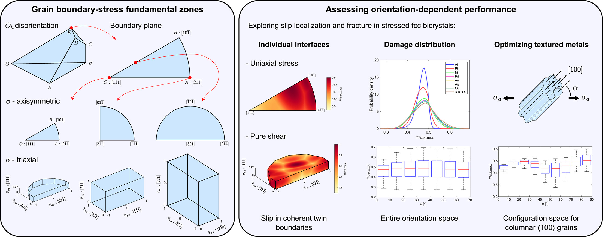

# Grain boundary-stress fundamental zones
Computational tools to make use of grain boundary-stress orientation fundamental zones of cubic metals with Oh point group symmetry, for axisymmetric and triaxial stresses. The functions in this toolbox allow for the development of quasi-equidistant grids in disorientation, boundary plane and stress fundamental zones, to map arbitrary configurations into their symmetrically equivalent ones within the fundamental zone, and to snap configurations into their closest condition within a predefined grid. This also includes an implementation of an elastic bicrystal incompatibility stress model and calculation of damage metrics.

The derivation and further details of this work have been published in: [F.D. León-Cázares, C. Alleman, A. Polonsky (2026) Acta Materialia 321, 122766](https://www.sciencedirect.com/science/article/pii/S1359645426008657). Please cite this publication if you benefit from this repository.

## Requirements
Coded in Matlab R2022a. 
Note: Function conflicts may occur if the MTEX toolbox is initialized.

## Dependencies
The 'inhull.m' function (https://www.mathworks.com/matlabcentral/fileexchange/10226-inhull/files/inhull.m) by John D'Errico is included in this repository. See `inhull_license.txt` for full licensing information.

## License
This repository is published under an MIT license (). See `LICENSE` for full licensing information.

## Contents
- [**functions/**](./functions/): MATLAB functions.
- [**Examples/**](./Examples/): Examples for the generation and usage of fundamental zones.
  
  - **Grid_disorientation.m, Grid_boundaryplane.m, Grid_stressuniaxial.m, Grid_stresstriaxial.m**: Generating grids over the multiple degrees of freedom of stress grain boundaries.
  - **MapToFZ.m**: Mapping randomly generated stressed bicrystals to their equivalent configurations within the fundamental zone. Analogous functions allow for the mapping to the fundamental zones of unstressed dichromatic lattices and grain boundaries.
  - **Snap2Grid.m**: Mapping randomly generated stressed bicrystals to their equivalent configurations within the fundamental zone, using the symmetries of their closest points from a predefined grid.
  - **Twin_boundary_uniaxial_loading.m, Twin_boundary_shear.m**: Plotting damage metrics onto the fundamental zones of fcc coherent twin boundaries.
  - **Damage_distributions.m**: Plotting the distibutions of damage metrics over the entire orientation space.

